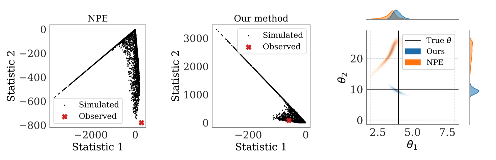

# Learning Robust Statistics for Simulation-Based Inference Under Model Misspecification: Code implementation



_______
**Note:** Our implementations build on the [sbi](https://github.com/mackelab/sbi) library by Macke's lab. 
You can find further details on its structure and the dependencies at the github website.
_______


## Installation
```
git clone https://github.com/huangdaolang/Robust-SBI.git

cd Robust-SBI

conda create --name robust-sbi python=3.8

conda activate robust-sbi

pip install -r requirements.txt
```

## Quick Start
The description of the simulators can be found in Section 4 of [our paper](https://arxiv.org/abs/2305.15871).

To run Ricker model, you can use the following template command lines:

```angular2html
python exp_ricker.py --distance="mmd" 
    --beta=1.0 
    --degree=0.0
```

For the above template command, we use *MMD*-based regularizer, and **beta** corresponds to the *lambda* in Equation 5 in our paper,
which is the weight of the regularizer. The **degree** corresponds to the misspecification degree *epsilon*, where `degree=0.0` means epsilon=0%. 

You can also define your own simulator and corresponding summary network, which you can find more details in `sbi` package's official document.

If you want to skip the long simulation process, you can use `generate_data.py` to pre-generate all simulated data and observed data.

After training, it will return `posterior`, `density_estimator` and `sum_net`. For `posterior` and `density_estimator`, please check the usage in `sbi` package's official document.
For `sum_net`, it is used to extract and analyse the summary statistics, you can load it with default pytorch function `torch.load()`.

Our implementation of regularizer is in `/inference/snpe/snpe_base.py`, from Line 345. The summary networks can be found in `inference/networks/summary_nets.py`.

ABC experiments for Ricker and OUP are included in `notebooks/ricker_abc.ipynb` and `notebooks/oup_abc.ipynb`.

Code for creating all figures in our paper can be found in `notebooks/plots.ipynb`.


## Citation
```
@article{huang2023learning,
  title={Learning Robust Statistics for Simulation-based Inference under Model Misspecification},
  author={Huang, Daolang and Bharti, Ayush and Souza, Amauri and Acerbi, Luigi and Kaski, Samuel},
  journal={arXiv preprint arXiv:2305.15871},
  year={2023}
}
```

## License
This code is under the MIT License.